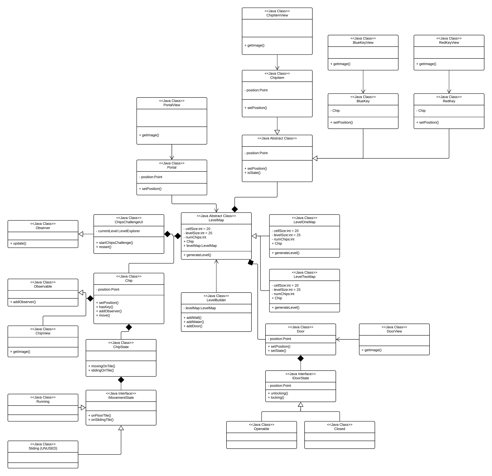
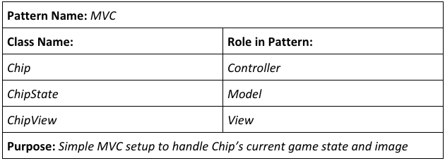
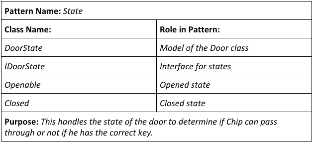
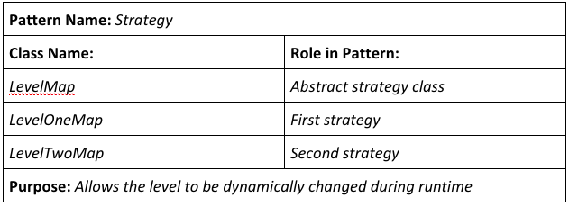

# Homework 3 Reflection
Anthony Luc (aluc)
October 18, 2018

# Note to Grader
Run the code using the main function in `ChipsChallengeUI`.

# Final Design
In my final design, I wanted to really try to get MVC correct. I think I got the general idea correct in regards to separating out the controller, the state, and a class for handling views, but some functions may be placed in "odd" locations for MVC standards. For instance, I wasn't sure if the controller or the state class would handle a function that checks Chip's inventory to see if he has a Red Key. Regardless, I think that my implementation does
a really good job at using MVC since my ChipsChallenge observes Chip and determines what objects he picks up or opens.

In addition, I implemented the strategy pattern using inheritance in which the current level uses a new `level###Map` object. This was helpful to allow me to set the current level and easily load it during runtime - e.g. the initial level, if the current level was reset due to falling in the water, or if the player progressed to the next level.

Furthermore, I used the state pattern for the doors. The door is either in the `Openable` or `Closed` states, and the doors will change state by observing Chip's inventory. Last, I originally wanted to use the state pattern for Chip to determine if he was walking or sliding, but time did not permit me implementing this.

Last, I designed a `LevelBuilder` class that would help me create each level. It uses an algorithm when given two points returns a list of grid squares that the line between the points pass through. I used this to easily generate walls and water. In the future, I can see that this could be extended to some sort of level building interface that lets the user quickly draw up a level with their mouse.

# What I would have done differently
First, I would have wanted to utilized the "Decorator" design pattern. Here, I think I'd need to create an abstract "Character" class. Chip will extend this class, and then I would create an "ItemDecorator" class that would return the inventory string (kind of like the beverage decorator example). Then, I would create keys and any other items as extending the decorator class and update the passed in "Character" object. I think this would have been a great implementation as it would allow me to not only let Chip pick up items but also to create NPC subclasses which could also potentially pick up keys and items. I could see it being fun gameplay design to chase after a bug that has stolen a key!

Last, I would want to have tried to implemented the "non-global" view of the map. I thin to do this, I would need a class represent the "smaller view". This SmallerView class would then get the current viewable 8x8 grid and display it to the user. This would make my maps which have a lot of nooks/crannies and hidden keys far more exciting to play.

# Final UML Diagram
In the updated UML diagram, you'll notice that the code mostly follows what is documented on the diagram. The only changes are that (1) I did not get around to making the ItemDecorator (2) I did not really use the Sliding state of Chip (3) I added move MVC classes (4) I implemeneted an abstract Item class to represent ChipItems and Red/Blue Keys.

# Design Patterns

