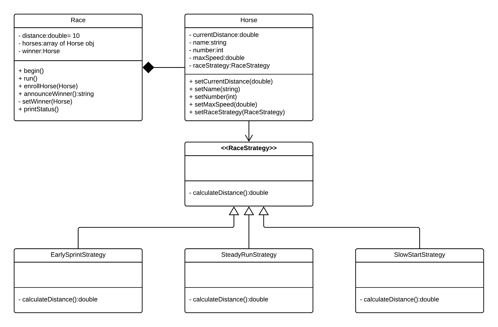

# Homework 2 Reflection
Anthony Luc (aluc)
September 10, 2018

# Design Decisions

In my design, I decided to make a Race class which contains an array of Horse class objects. I figured that implementing a *composition* of a Race class with multiple Horse objects would work the best because I could pass around Horse objects to methods such as `enrollHorse` and `setWinner`. Furthermore, I implemented a `RaceStrategy` interface with the three required strategy *implementing* this interface. This allowed me to also pass in Horse objects to determine how much they
move in one iteration of the `for-loop`. Last, the strategy pattern also afforded me the ability to alter the race strategy of a horse in the middle of a race (note: this is tested in test5, but it's not currently set up to do easily using the Race class).

# UML Diagram

